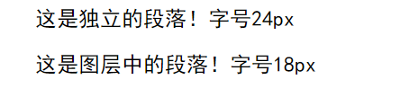

因为找了好一会的bug，所以写下来记录一下，大概是因为我是vegetable  

```html
<html>
	<head>
		<style type="text/css">
			p{
				font-size:24px;
				font-family:黑体;
				text-indent:2em;<!--这是一个注释-->
				color:red;
			}

			#div1 p{
				font-size:18px;
				color:blue;
			}
		</style>
	</head>
	<body>

		<p> 这是独立的段落！字号24px</p>
		<div id="div" class="">
			<p> 这是图层中的段落！字号18px</p>
		</div>
	</body>
</html>
```


<br/>

显然不是我们想要的结果，第一点，是id写错了；第二点，在style里面用html的方式写注释，会导致样式表定义失败，要使用css的注释语法

<br/>

```html
<html>
	<head>
		<style type="text/css">
			p{
				font-size:24px;
				font-family:黑体;
				text-indent:2em;/*这是一个注释*/
				color:red;
			}

			#div1 p{
				font-size:18px;
				color:blue;
			}
		</style>
	</head>
	<body>

		<p> 这是独立的段落！字号24px</p>
		<div id="div1" class="">
			<p> 这是图层中的段落！字号18px</p>
		</div>
	</body>
</html>
```

